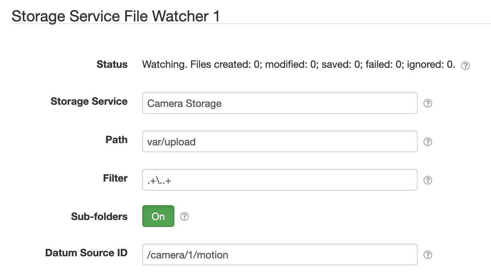

# SolarNode Storage Service Upload

This SolarNode plugin provides a component that can monitor a directory for new or updated files and
copy them to a Storage Service. This provides a way to automatically upload files created by another
plugin or process to be uploaded somewhere, such as S3 by using the [S3 Storage
Service][s3-storage-service].

# Install

The plugin can be installed via the **Plugins** page on your SolarNode. It
appears under the **Upload** category as **Storage Service Upload**. Once installed,
a **Storage Service File Watcher** component will become available.

# Configuration

Each service configuration contains the following settings:

| Setting         | Description  |
|-----------------|--------------|
| Storage Service | The **Service Name** of the Storage Service component to copy files to. |
| Path            | The OS file system path to monitor. |
| Filter          | A regular expression to filter, so that only files matching the filter are copied. |
| Sub-folders     | Toggle watching for files in sub-folders of <b>Path</b>. |

[s3-storage-service]: ../net.solarnetwork.node.io.s3/
