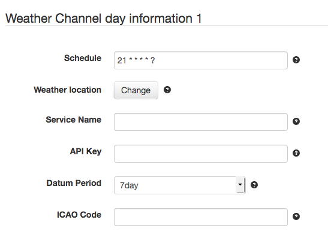
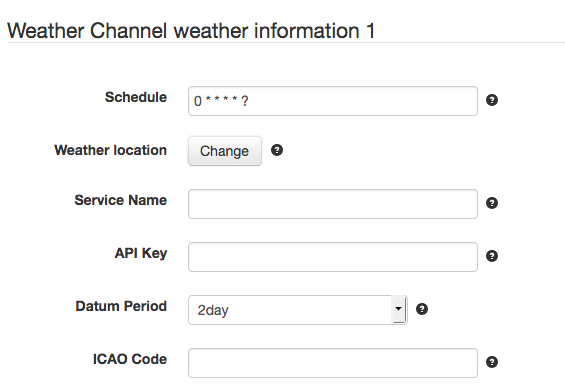

# SolarNode IBM Weather Channel Datum Source

This project provides SolarNode plugin that can collect data from the IBM Weather Channel
API, for day information (sunrise, sunset, etc) as well as weather condition forecasts.

# Install

The plugin can be installed via the **Plugins** page on your SolarNode. It appears under
the **Weather** category as **IBM Weather Channel**.

# Use

Once installed, two new components will appear on the **Settings** page on your SolarNode:
**Weather Channel day information** and **Weather Channel weather information**  Click on
the **Manage** button to configure either data source. You'll need to add one
configuration for each type and location  you want to collect data from.

## Overall settings

Each configuration contains the following overall settings:

| Setting            | Description                                                                      |
|--------------------|----------------------------------------------------------------------------------|
| Schedule           | A cron schedule that determines when data is collected.                          |
| Weather Location   | The SolarNetwork weather location to associate the collected data with.          |
| Service Name       | A unique name to identify this data source with.                                 |
| API Key            | The IBM Weather Channel API key to authenticate with.                            |
| Datum Period       | The forecast period to collect data for.                                         |
| ICAO Code          | The [location](https://en.wikipedia.org/wiki/ICAO_airport_code) to collect for.  |
