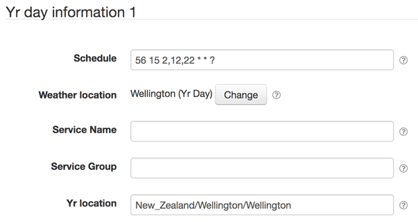
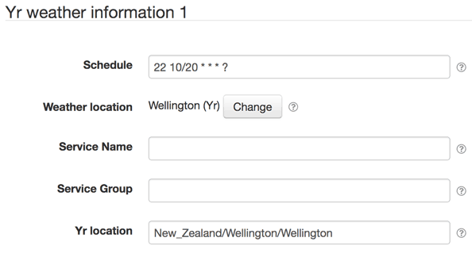

# SolarNode Yr Weather Datum Source

This project provides SolarNode plugin that can collect data from [Yr](https://www.yr.no/)
for day information (sunrise, sunset, etc) as well as weather condition forecasts.

# Install

The plugin can be installed via the **Plugins** page on your SolarNode. It appears under
the **Weather** category as **Yr Weather**.

# Use

Once installed, two new components will appear on the **Settings** page on your SolarNode:
**Yr day information** and **Yr weather information**  Click on
the **Manage** button to configure either data source. You'll need to add one
configuration for each type and location  you want to collect data from.

## Overall settings

Each configuration contains the following overall settings:

| Setting            | Description                                                                      |
|--------------------|----------------------------------------------------------------------------------|
| Schedule           | A cron schedule that determines when data is collected.                          |
| Weather location   | The SolarNetwork weather location to associate the collected data with.          |
| Service Name       | A unique name to identify this data source with.                                 |
| Service Group      | A group name to associate this data source with.                                 |
| Yr location        | The Yr location identifier to collect data from.                                 |

## Overall settings notes

<dl>
	<dt>Yr location</dt>
	<dd>Generally you can find the location identifier on the <a href="https://www.yr.no">Yr
	website</a> by searching for a place name. Once you get to the page of the place you're
	interested in, the identifier will be the URL path fragment after <code>place/</code>
	and without any trailing slash. For example, the for the Yr place URL
	<a href="https://www.yr.no/place/New_Zealand/Wellington/Wellington/">https://www.yr.no/place/New_Zealand/Wellington/Wellington/</a>
	the Yr location identifier is <code>New_Zealand/Wellington/Wellington</code>.</dd>
</dl>
