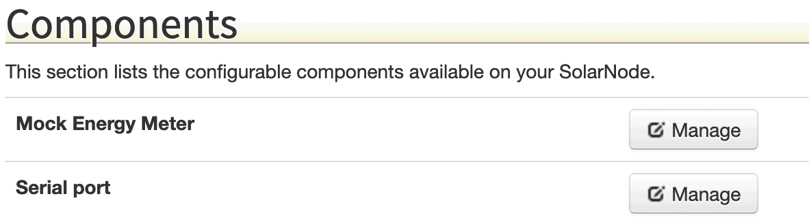
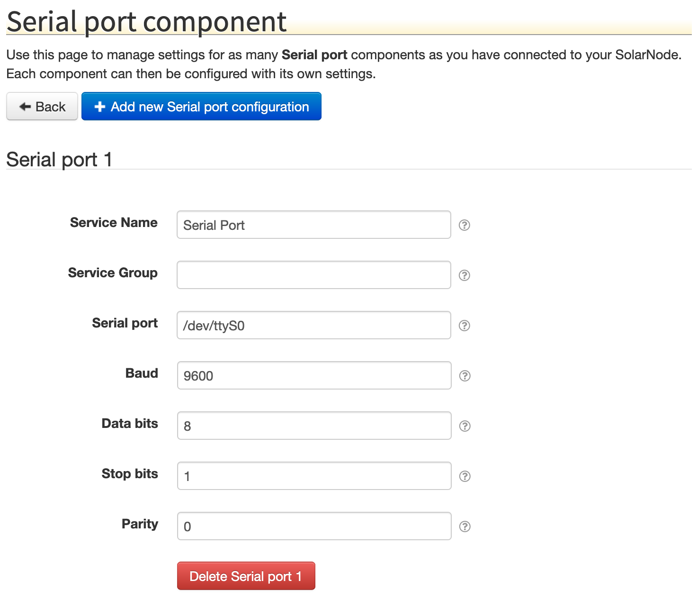

# SolarNode Settings

SolarNode provides an API for managing user-configurable _settings_. Other plugins can register
_settings provider_ OSGi services at runtime, and SolarNode will show those settings and make them
editable in the SolarNode UI.

TODO

# Managed Service Factory Settings

The OSGi Configuration Admin framework defines the [`ManagedServiceFactory`][ManagedServiceFactory]
API to allow multiple, independent instances of a given service to be managed at runtime, each 
with their own configuration properties. The SolarNode Settings API can work with this API, and 
provides the Gemini Blueprint `<managed-service-factory>` extension to make it easier to configure
this in OSGi Blueprint.

The SolarNode UI shows all available service factories under a **Components** section of the 
Settings page:



In that screen shot there are two service factories: a **Mock Energy Meter** and a **Serial port**.
Clicking on the _Manage_ button for a given service factory shows a UI where instances of that
service can created and then configured:



## OSGi Blueprint configuration

To integrate `ManagedServiceFactory` into the SolarNode Settings API, first a _component factory_
must be published. The API for this is 
[`net.solarnetwork.node.settings.SettingSpecifierProviderFactory`][SettingSpecifierProviderFactory].
This factory must define a unique ID, its `factoryUID` property. The ID can be anything, but it 
is common to use a domain-style name like a Java class. The 
`net.solarnetwork.node.settings.support.BasicSettingSpecifierProviderFactory` class implements this
API.

Here's an example of a plugin publishing a configurable serial port component factory in OSGi
Blueprint:

```xml
<service interface="net.solarnetwork.node.settings.SettingSpecifierProviderFactory">
	<bean class="net.solarnetwork.node.settings.support.BasicSettingSpecifierProviderFactory">
		
		<!-- Define a unique factory ID for the component -->
		<property name="factoryUID" value="net.solarnetwork.node.io.serial.pjc"/>

		<!-- Provide a non-localized display name -->
		<property name="displayName" value="PJC Serial Port"/>
		
		<!-- Provide a localized name and description via a Spring MessageSource -->
		<property name="messageSource" ref="messageSource"/>
	</bean>
</service>

<bean id="messageSource" class="org.springframework.context.support.ResourceBundleMessageSource">
	<property name="basenames" value="net.solarnetwork.node.io.serial.pjc.PjcSerialNetwork"/>
</bean>
```

The `messageSource` bean provides a localizable display name and description. The referenced 
`PjcSerialNetwork.properties` file should contain `title` and optional `desc` keys for the factory:

```
title = Serial port
```

Next, the actual `<managed-service-factory>` must be configured. There are **two** places where the
`factoryUID` value configured on the `SettingSpecifierProviderFactory` must also be configured:
first as the `@factory-pid` attribute on the `<managed-service-factory>` itself, and second as a
`(settingPid=X)` factory service property. 

Here's an example of a plugin publishing a configurable serial port service factory in Gemini
Blueprint:

```xml
<!-- The factoryUID value from the SettingSpecifierProviderFactory must be uesd as the factory-pid
     attribute here: -->
<osgix:managed-service-factory factory-pid="net.solarnetwork.node.io.serial.pjc" autowire-on-update="true">
	<osgix:interfaces>
		<beans:value>net.solarnetwork.node.io.serial.SerialNetwork</beans:value>
		<beans:value>net.solarnetwork.node.settings.SettingSpecifierProvider</beans:value>
	</osgix:interfaces>
	<osgix:service-properties>
		<!-- The factoryUID value from the SettingSpecifierProviderFactory must be added as a 
		     settingPid service property here: -->
		<beans:entry key="settingPid" value="net.solarnetwork.node.io.serial.pjc"/>
	</osgix:service-properties>
	
	<!-- Here's the factory template service: one of these will be instantiated at runtime 
	     per component added in the SolarNode UI: -->
	<bean class="net.solarnetwork.node.io.serial.pjc.PjcSerialNetwork">
		<property name="messageSource" ref="messageSource"/>
	</bean>
</osgix:managed-service-factory>
```


[ManagedServiceFactory]: https://docs.osgi.org/javadoc/r4v42/org/osgi/service/cm/ManagedServiceFactory.html
[SettingSpecifierProviderFactory]: ../src/net/solarnetwork/node/settings/SettingSpecifierProviderFactory.java
